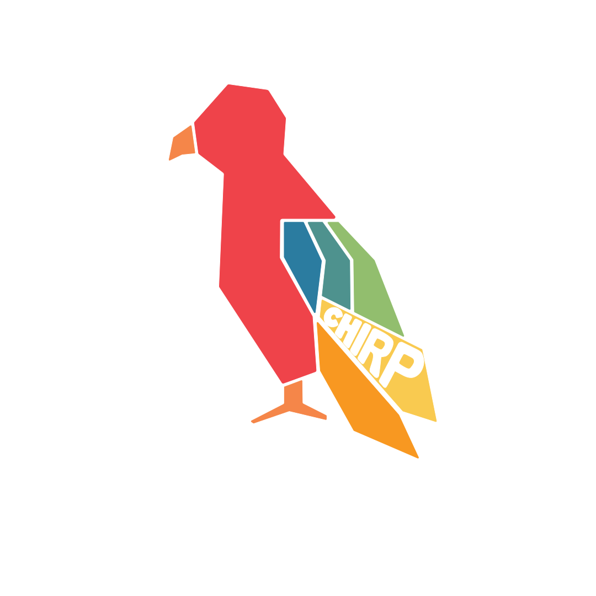

  <!-- Title -->

<h1><strong>Chirp</strong></h1>
  <!-- Badges -->
  

    
    
  

 

<!-- Table of Contents -->

# Table of Contents

- [About the Project](#about-the-project)
  - [Summary](#summary)
  - [Tech Stack](#tech-stack)
- [Contact](#contact)
- [Acknowledgements](#acknowledgements)

<!-- About the Project -->

# About the Project

<!-- Summary -->

### Summary

I worked with a team from American University to compete in the AU Invent 2 Prevent Challenge, a nationwide competition hosted by the Department of Homeland Security. The challenge aims to create and fund a curriculum for American middle schools to help prevent targeted violence. Our team developed Chirp, an online game that mimics the unfiltered content one might encounter while scrolling through Twitter. Chirp was integrated into the team's presentation and was used in a Washington, D.C., middle school, where it elicited a positive response from the students.

<!-- Tech Stack -->

### Tech Stack

<!-- Shields.io Badges: https://github.com/Ileriayo/markdown-badges -->

    
Client

     
    

    
Server

     
    

    
Database

     
    

<!-- Control Flow -->

<!-- Contact -->

## Contact

#### Victor Rinaldi:

<!-- Acknowledgments -->

## Acknowledgements
- [Shields.io](https://shields.io/)
